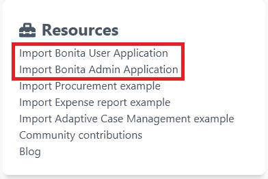

# Deploying the Bonita User and Administrator Applications

This page describes how to get the two applications and how to deploy them into a Tomcat bundle or the cloud.

## How to get the applications 

You can get the applications in two different ways, either from the Studio welcome page or from their two GitHub repositories.
Moreover, the two repositories have two ways to get the applications.

To get the pages from the Studio welcome page, all you need to do is to click on the link for the corresponding application.



This will open an import window, which will let you import the application.

For a more technical user, there is a second way to get the applications. You can get it from it's corresponding GitHub repository. 
For the user application, you can find it in the [user application repository](https://github.com/bonitasoft/bonita-user-application/).
And for the admin one, you can find it in the [admin application repository](https://github.com/bonitasoft/bonita-admin-application/).
There are two ways to get the .bos file. You can either get it from the *Releases* on the right or by cloning the repository of your choice and building it using maven.
Building the repository will create a .bos file in the ```target``` folder. You can import this one into the development environment.
<br>Using this method is also useful if you want to get an older version of an application or if you need a weekly version that contains a bugfix.

Now that you got the applications, you can deploy them into your locally running server using the Studio deployment.

A way to deploy the applications into a bundle or into your cloud platform is explained in the [applications](applications.md) page.

### Use BCD

::: info
**Note:** For Enterprise, Performance, Efficiency, and Teamwork editions only.
:::

The second way to deploy the applications into a bundle or the cloud is to use [BCD](https://documentation.bonitasoft.com/bcd//_manage_living_application). 
This will let you easily deploy an app from a development environment into your bundle or cloud.
